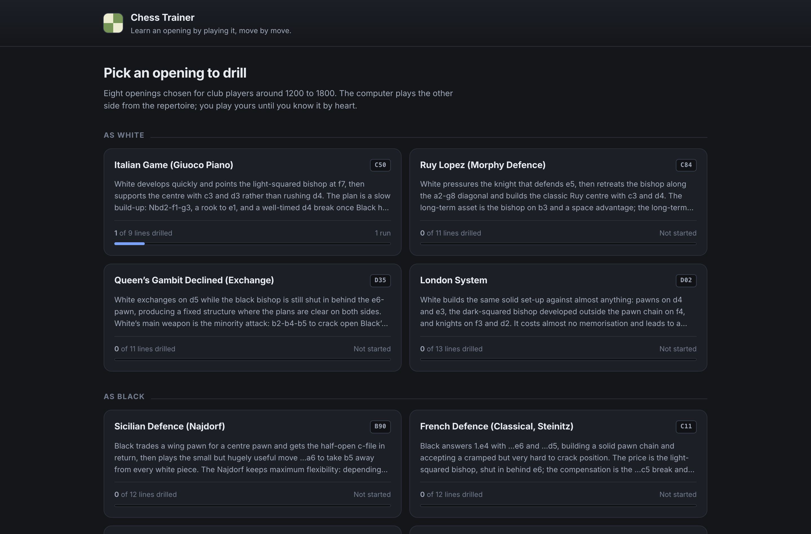
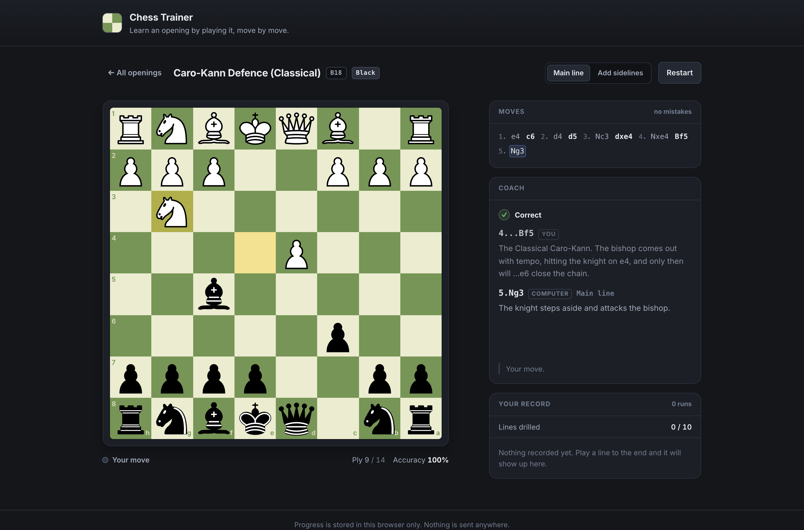
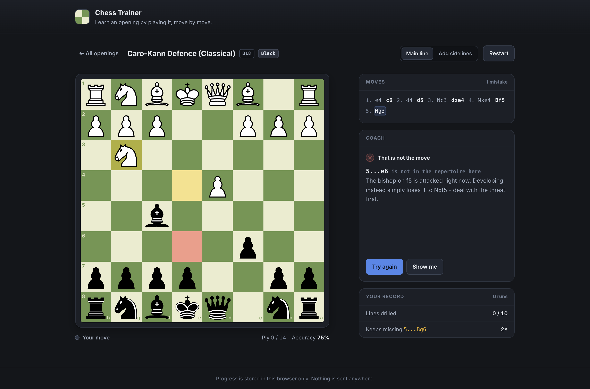
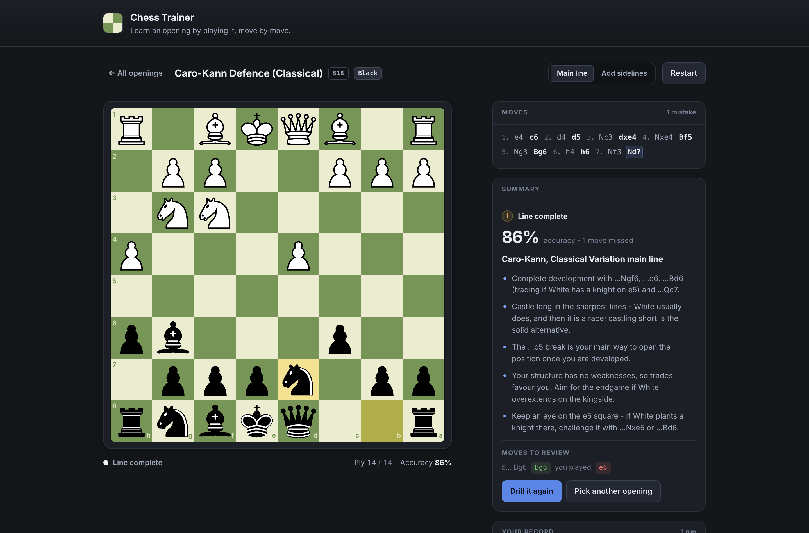
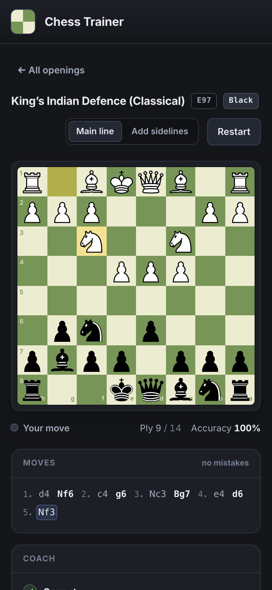

# Chess Trainer

A local, offline-first web app for learning chess openings.
Pick an opening suited to a club player, then drill it against the computer until you know it.

The computer plays the opposing side straight from a repertoire tree.
You play your own moves by drag-and-drop or click-click.
A wrong move is never silently accepted: the board refuses it, the coach panel says why, and you can either try again or ask to be shown.



## Running it

```sh
npm install
npm run dev
```

The dev server prints a local URL; open it in a browser.
There is no backend and no network access at runtime, so it works offline.

| Command | What it does |
| --- | --- |
| `npm run dev` | Start the Vite dev server |
| `npm run build` | Type-check and build to `dist/` |
| `npm run preview` | Serve the production build |
| `npm test` | Run the vitest suite once |
| `npm run test:watch` | Run vitest in watch mode |
| `npm run lint` | Run oxlint |

## What is in the repertoire

Eight openings, aimed at roughly 1200 to 1800 rated players, four from each side.

| Opening | ECO | Side |
| --- | --- | --- |
| Italian Game (Giuoco Piano) | C50 | White |
| Ruy Lopez (Morphy Defence) | C84 | White |
| Queen's Gambit Declined (Exchange) | D35 | White |
| London System | D02 | White |
| Sicilian Defence (Najdorf) | B90 | Black |
| French Defence (Classical, Steinitz) | C11 | Black |
| Caro-Kann Defence (Classical) | B18 | Black |
| King's Indian Defence (Classical) | E97 | Black |

Each opening carries a main line of 12 to 16 plies plus the most common opponent deviations at the points where the opening really branches, each with the correct reply and its own end-of-line summary.

Two drill modes:

- **Main line** always plays the principal variation, so you can grind one line until it is automatic.
- **Add sidelines** mixes in the deviations, so you meet the moves an opponent actually plays.



A wrong move is caught immediately, with a reason that does not give the answer away:



At the end of a line you get the accuracy for that run and the middlegame plans of the position you have reached:



It works down to phone width:



## Progress

Progress lives in `localStorage` under `chess-trainer:progress:v1` and survives a reload.
Per opening it records how many runs you have played, which lines you have finished with what accuracy, and, most usefully, the moves you keep getting wrong.

Wrong moves are recorded the moment they happen rather than at the end of the run: a line someone gives up on is exactly the line worth remembering.

Nothing leaves the browser.

## How the code is laid out

```
src/
  data/
    types.ts             the MoveNode / Opening types
    openings/            one file per opening, plus index.ts
    openings.test.ts     validates every line against chess.js
  engine/
    tree.ts              traversal, SAN matching, correct/incorrect judgement
    session.ts           the training loop as a set of pure transitions
    progress.ts          the localStorage record
  components/
    Board.tsx            react-chessboard wrapper: highlights and move input
    Trainer.tsx          board + coach + record, wired to the session
    FeedbackPanel.tsx    the coach panel during play
    LineSummary.tsx      the end-of-line summary
    OpeningPicker.tsx    the opening grid
    MoveList.tsx         the scoresheet
```

The real logic lives in `src/engine`, and it is all pure functions over plain data, which is why that is where the tests are.
`Board.tsx` is the only place that knows about the board library.

## Adding an opening

1. **Write the file.** Copy the shape of an existing one, for example `src/data/openings/italian.ts`.

   ```ts
   import type { Opening } from '../types'

   export const myOpening: Opening = {
     id: 'my-opening',        // stable slug, also the localStorage key - never change it
     name: 'My Opening',
     eco: 'A00',
     side: 'white',           // the colour the user trains
     summary: 'One or two sentences on the strategic idea.',
     tree: [ /* see below */ ],
   }
   ```

2. **Build the move tree.** `tree` holds the children of the *initial position*, so its entries are always White's first move, whichever colour the user plays.
   Each node is one ply:

   ```ts
   {
     san: 'e4',                     // exactly as chess.js writes it
     idea: 'Why this move is played. Shown once it is on the board.',
     hint: 'A nudge for a wrong move that does not give the answer away.',
     mistakes: [                    // optional, user nodes only
       { san: 'd4', why: 'Why this particular wrong move is wrong.' },
     ],
     children: [ /* replies */ ],
     end: { name: '...', plans: ['...'] },  // on the last node of a path
   }
   ```

   Whose move a node represents is derived from its depth and the opening's `side`, so it is never stored.

   - At a **user** turn, list exactly one child: the repertoire move. It needs `idea` and `hint`.
   - At an **opponent** turn, list two to four children. The first is the main line and the rest are deviations, and each needs a `label` naming the try. In `Add sidelines` mode the computer picks among them.
   - Every path must end at a node carrying `end`, with at least two `plans`.

3. **Register it** in `src/data/openings/index.ts`:

   ```ts
   import { myOpening } from './my-opening'

   export const OPENINGS: Opening[] = [/* ... */, myOpening]
   ```

4. **Run the tests.** `npm test` will not let a broken opening through. `src/data/openings.test.ts` replays every root-to-leaf path through chess.js and checks that:

   - every move is legal in the position it is played from;
   - every SAN is spelled exactly as chess.js writes it, disambiguation included, so `Nfd7` fails if the position needs `Nbd7`;
   - every named mistake is a legal move, is not the repertoire move, and has a real explanation;
   - every user move has an `idea` and a `hint`;
   - every opponent choice at a branch point has a `label`;
   - every path ends with a summary, and no two paths end on the same position.

   `src/engine/session.test.ts` then plays every line of every opening through the training loop and checks that a wrong move is rejected with an explanation at every single user turn.

   This is deliberately strict. A trainer that teaches a wrong move is worse than no trainer.

## Notes on the theory

The lines are standard main lines and named deviations, with the explanations written in terms of plans and structures rather than concrete evaluations.
Where a sharp tactical claim could not be stated with confidence, the repertoire gives a sound, well-established move and explains the plan instead of asserting an evaluation it cannot back.

## Stack

Vite, React, TypeScript, `chess.js` for rules and FEN, `react-chessboard` for the board, vitest for tests, oxlint for linting.
No backend, no chess engine, no network calls at runtime.
