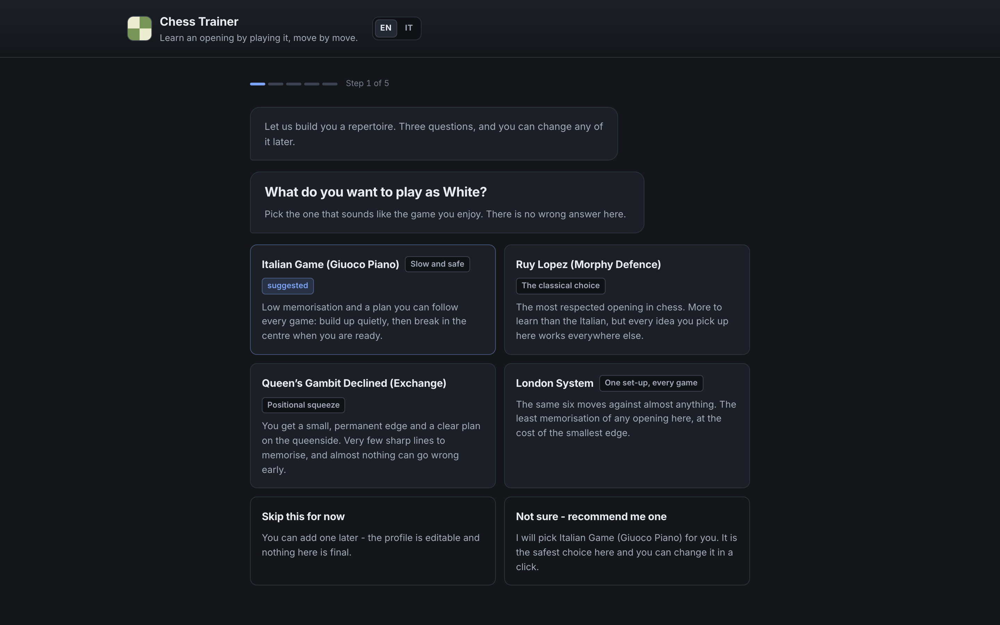
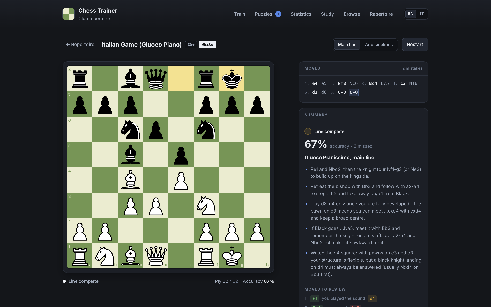
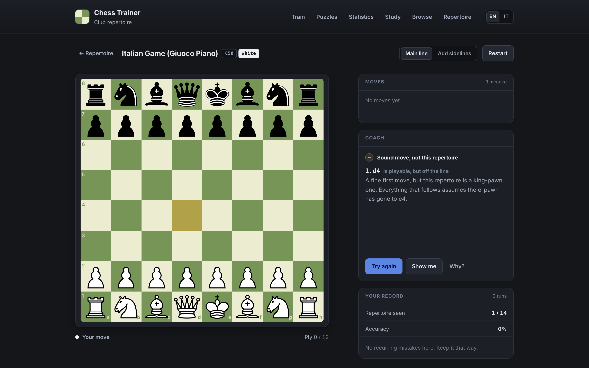
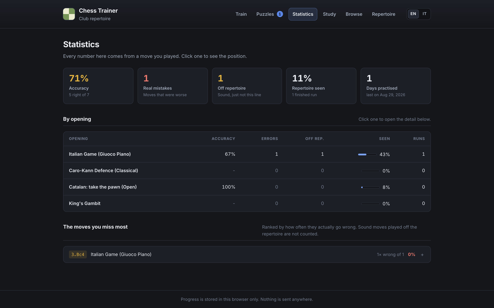
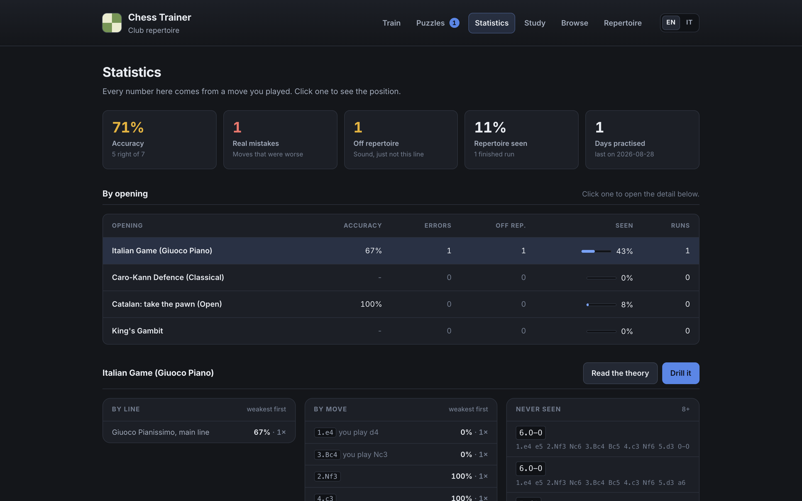
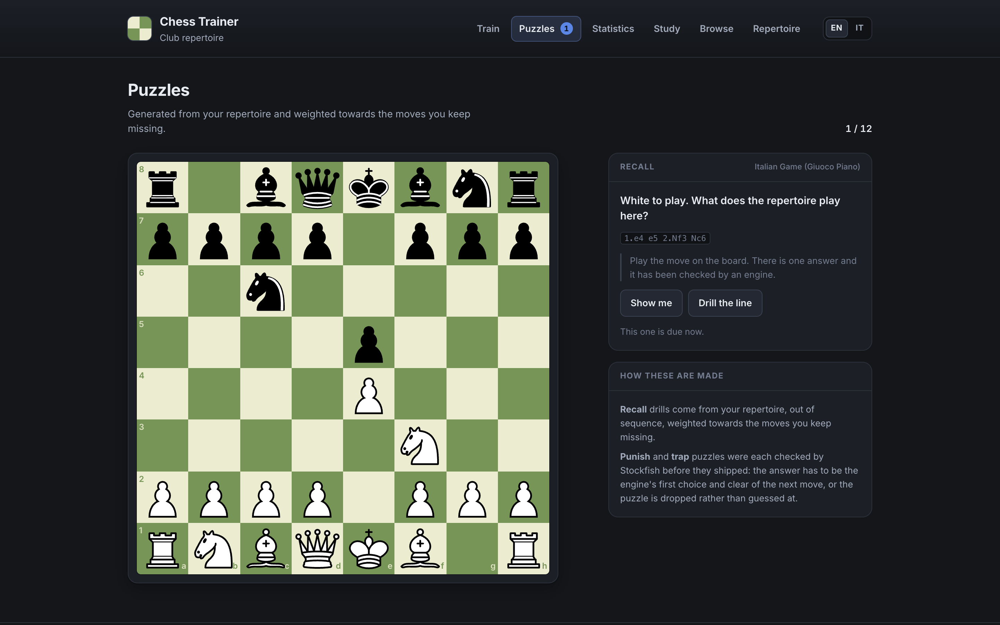
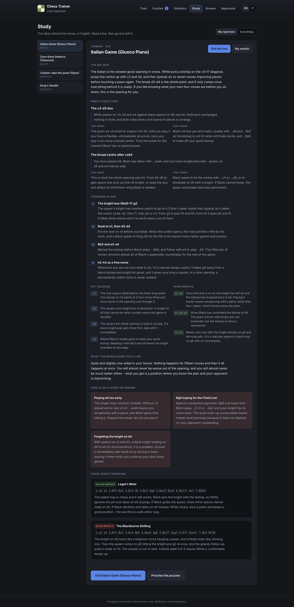
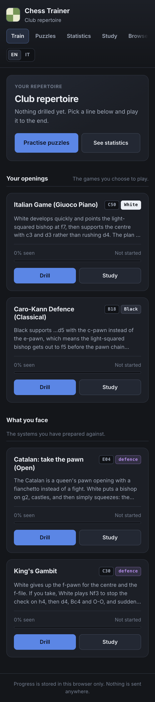

# Chess Trainer

A local, offline-first web app for building and drilling a personal chess opening repertoire.

Answer three questions and it builds you a repertoire: what you play as White, what you play as Black, and - the part most trainers skip - what to do against the openings you keep facing.
Then it drills you on it, tracks every move you play, generates puzzles from your own weak spots, and explains the ideas behind the moves in plain English.

The computer plays the opposing side straight from a repertoire tree.
You play your own moves by drag-and-drop or click-click.
A wrong move is never silently accepted: the board refuses it, the coach panel says why, and you can either try again or ask to be shown.



## Running it

```sh
npm install
npm run dev
```

The dev server prints a local URL; open it in a browser.
There is no backend and no network access at runtime, so it works offline.

| Command | What it does |
| --- | --- |
| `npm run dev` | Start the Vite dev server |
| `npm run build` | Type-check and build to `dist/` |
| `npm run preview` | Serve the production build |
| `npm test` | Run the vitest suite once |
| `npm run test:watch` | Run vitest in watch mode |
| `npm run lint` | Run oxlint |
| `npm run verify:theory` | Engine-check the repertoire and regenerate the puzzles (needs Stockfish, see below) |
| `npm run check:browser` | Walk the whole app in a real browser and take the screenshots (needs Puppeteer, see below) |

## What is in it

### Openings you choose

Eight openings aimed at roughly 1200 to 1800 rated players, four from each side.

| Opening | ECO | Side |
| --- | --- | --- |
| Italian Game (Giuoco Piano) | C50 | White |
| Ruy Lopez (Morphy Defence) | C84 | White |
| Queen's Gambit Declined (Exchange) | D35 | White |
| London System | D02 | White |
| Sicilian Defence (Najdorf) | B90 | Black |
| French Defence (Classical, Steinitz) | C11 | Black |
| Caro-Kann Defence (Classical) | B18 | Black |
| King's Indian Defence (Classical) | E97 | Black |

### Defences, indexed by what the opponent plays

The other half of a repertoire is knowing what to do when someone plays *their* opening at you.
Twelve prepared answers, indexed by the system you are facing rather than by the one you chose.

| Against | System | Answer |
| --- | --- | --- |
| 1.d4 | Catalan | Open (4...dxc4) or Closed (...Be7, ...c6) - pick a temperament |
| 1.d4 | London System | ...c5 and ...Qb6, hitting b2 and d4 |
| 1.d4 | Trompowsky | 2...Ne4, refusing the doubled pawns |
| 1.d4 | Colle / Zukertort | 3...Bf5 before ...e6, trading the attacking bishop |
| 1.d4 | Blackmar-Diemer and early gambits | Take, then the Euwe set-up with ...e6 and a quick castle |
| 1.e4 | King's Gambit | Decline with 2...Bc5; fxe5 loses to ...Qh4+ |
| 1.e4 | Scotch | 4...Bc5 and the classical ...Qf6, ...Nge7, ...Ne5, ...Qg6 |
| 1.e4 | Vienna | 2...Nf6 and, against 3.f4, the central counter ...d5 |
| 1.e4 | Danish / Goring gambits | Decline with ...d5 and hand the pawn straight back |
| Flank | English | ...e5, the reversed Sicilian, and ...Nb6 rather than ...Nxc3 |
| Flank | Reti | ...d5 and ...e6, then ...c5 once castled |

Each defence names the opponent's system, the position where it becomes recognisable, what they are trying to do, the concrete recipe against it, and the traps that actually catch people at this level.
The Catalan gets two full answers so you can choose between taking the pawn and building a wall.

Between them the twenty entries hold 139 complete lines, 334 decision points where you have to find a move, and 34 named traps split between ones you can spring and ones you have to see coming.



A wrong move is caught immediately, with a reason that does not give the answer away - and a *sound* move that simply is not this repertoire is told apart from an actual mistake:



## The setup conversation

The front door is a short guided conversation rather than a grid of cards: one question at a time, in plain language, with a short reason for each option, a "not sure, recommend me one" answer on every question that has a sensible default, and a way back at every step.

At the end it saves a named **repertoire profile** and takes you straight into training.
Profiles are editable later, and you can keep as many as you like - progress is never deleted by switching between them.

The browse-everything grid is still there under **Browse** for anyone who just wants to poke around.

## Statistics

Drawn from the moves you actually played, not from vanity counters.

- Accuracy per opening, per line and per individual move, so the weakest link is visible.
- The moves you miss most, ranked, with the position and the correct answer one click away.
- Progress over time: accuracy per day, so you can see whether you are getting better at something or just repeating it.
- Coverage: how much of your repertoire you have ever been asked for, and which moves you have never once seen.

Throughout, a **real mistake** (a move that is worse) is counted separately from an **off-repertoire choice** (a sound move this repertoire does not play).
Playing the Ruy Lopez against an Italian repertoire is a preference, not a weakness, and adding the two together would make every number on the page a lie.



Every ranked move opens to the position it came from, the answer, and what you have played there instead:



## Puzzles

Generated from your own repertoire and your own record, not from a generic tactics dump.

- **Recall drills** put a position from your repertoire on the board out of sequence and ask for the move, weighted towards the moves you keep missing.
- **Punish-the-mistake puzzles** take the tempting wrong moves already in the repertoire data, put the *opponent* in that seat, and ask you to show why the move fails.
- **Trap awareness** covers the known traps in every opening and every defence, from both sides: one you can spring, one you have to see coming.

Scheduling is simple spaced repetition on a stated ladder - 1, 2, 5, 12, 30 and 75 days.
Something you missed yesterday comes back today; something you have answered right five times in a row comes back in a month.
A recall puzzle and the same move met while drilling share one card, so the two never disagree about what you know.

Every punish and trap puzzle is verified by Stockfish **before it ships**, at the same depth as the theory check: the answer has to be the engine's first choice and at least 90 centipawns clear of the next move.
A candidate that fails either test is dropped rather than guessed at, and the run reports which.
Nothing is evaluated at runtime - the app ships no engine and makes no network calls.



## Study

A readable guide per opening and per defence, written for a 1200-1800 player: the big idea, the pawn structures and what each side wants from them, the standard plans and piece manoeuvres, the key squares and pawn breaks, what the middlegame actually feels like, and the ways club players go wrong.

It is linked to the drills in both directions - read a line then drill it, or fail a move and read why it matters.



It works down to phone width:



## Progress and storage

Progress lives in `localStorage` under `chess-trainer:progress:v2` and survives a reload.
It records repertoire profiles, every attempt at every decision point (what you answered and when), finished runs, spaced-repetition cards, and puzzle attempts.

**Upgrading from version 1.** A version 1 record is migrated automatically the first time the app loads, and the old key is left in place so nothing is lost.
Version 1 only ever counted failures, so the migrated move records show attempts equal to errors - which is exactly what it knew, and no more.
New attempts land on top and the picture corrects itself within a session or two.

Nothing leaves the browser.

## How the code is laid out

```
src/
  data/
    types.ts             MoveNode / Opening / Defence / Trap / Puzzle / StudyGuide
    openings/            one file per opening, plus index.ts
    defences/            one file per defence, plus index.ts
    study/               the long-read guides, keyed by entry id
    entries.ts           openings + defences as one list
    puzzles.generated.ts GENERATED by verify:theory - verified puzzles only
    verify-entry.ts      bundle entry point for the dev scripts
    openings.test.ts     validates every line against chess.js
  engine/
    tree.ts              traversal, SAN matching, correct/incorrect judgement
    session.ts           the training loop as a set of pure transitions
    progress.ts          the versioned record, its reducers and the v1 migration
    stats.ts             aggregation for the statistics page
    scheduler.ts         the spaced-repetition ladder
    puzzles.ts           puzzle generation from the repertoire
    profile.ts           the setup conversation as a state machine
  components/
    Board.tsx            react-chessboard wrapper: highlights and move input
    SetupConversation.tsx  the guided setup
    Home.tsx             the repertoire dashboard
    Trainer.tsx          board + coach + record, wired to the session
    Statistics.tsx       the statistics page
    Puzzles.tsx          the puzzle session
    Study.tsx            the study section
    Browse.tsx           the browse-everything grid
    ProfileEditor.tsx    managing repertoire profiles
```

The real logic lives in `src/engine`, and it is all pure functions over plain data, which is why that is where the tests are.
`Board.tsx` and `MiniBoard.tsx` are the only places that know about the board library.

## Adding an opening

1. **Write the file.** Copy the shape of an existing one, for example `src/data/openings/italian.ts`.

   ```ts
   import type { Opening } from '../types'

   export const myOpening: Opening = {
     kind: 'opening',
     id: 'my-opening',        // stable slug, also a storage key - never change it
     name: 'My Opening',
     eco: 'A00',
     side: 'white',           // the colour the user trains
     summary: 'One or two sentences on the strategic idea.',
     traps: [ /* see below */ ],
     tree: [ /* see below */ ],
   }
   ```

2. **Build the move tree.** `tree` holds the children of the *initial position*, so its entries are always White's first move, whichever colour the user plays.
   Each node is one ply:

   ```ts
   {
     san: 'e4',                     // exactly as chess.js writes it
     idea: 'Why this move is played. Shown once it is on the board.',
     hint: 'A nudge for a wrong move that does not give the answer away.',
     mistakes: [                    // optional, user nodes only
       { san: 'd4', why: 'Why this particular move is not played here.' },
       // `deliberate` means the move is objectively sound and is declined on
       // repertoire grounds, not because it is bad. The trainer then says
       // "sound move, not this repertoire" instead of calling it an error, and
       // the statistics count it separately from a real mistake.
       { san: 'Bb5', deliberate: true, why: 'A perfectly good move, but that is the Ruy Lopez.' },
     ],
     punish: true,                  // optional, opponent nodes only - see below
     children: [ /* replies */ ],
     end: { name: '...', plans: ['...'] },  // on the last node of a path
   }
   ```

   Whose move a node represents is derived from its depth and the entry's `side`, so it is never stored.

   - At a **user** turn, list exactly one child: the repertoire move. It needs `idea` and `hint`.
   - At an **opponent** turn, list two to five children. The first is the main line and the rest are deviations, and each needs a `label` naming the try. In `Add sidelines` mode the computer picks among them.
   - `punish: true` on an opponent node says the branch is there *because* the move loses - the King's Gambit's 3.fxe5 is one. The verifier then requires it to be losing rather than plausible, and the puzzle generator builds a punish exercise from it.
   - Every path must end at a node carrying `end`, with at least two `plans`.

3. **Add the traps.** At least one per entry, with both sides represented across the set:

   ```ts
   traps: [
     {
       id: 'legal-mate',                       // unique within the entry
       name: "Legal's Mate",
       owner: 'ours',                          // 'ours' to spring, 'theirs' to avoid
       moves: ['e4', 'e5', 'Nf3', 'Nc6', 'Bc4', 'd6', 'Nc3', 'Bg4', 'Nxe5'],
       setup: 8,                               // index of the move that is the point
       point: 'What the trap does, in plain English.',
     },
   ]
   ```

4. **Write the study guide** in `src/data/study/openings.ts`, keyed by the same id.
   The tests check it has a real big idea, at least one pawn structure described from both sides, three plans, two key squares, a pawn break, a middlegame description and two pitfalls - and that it reads as English rather than as a game score.

5. **Register it** in `src/data/openings/index.ts`.

6. **Run the tests.** `npm test` will not let a broken opening through - see the section below.

## Adding a defence

A defence is the same move tree with a different index: it is filed under what the *opponent* plays.

1. **Write the file** in `src/data/defences/`, copying the shape of `src/data/defences/london.ts`:

   ```ts
   import type { Defence } from '../types'

   export const vsSomething: Defence = {
     kind: 'defence',
     id: 'vs-something',          // stable slug, `vs-` prefixed by convention
     name: 'Their System',
     eco: 'A00',
     side: 'black',               // a defence is always played from the black side
     system: 'Their System',      // two entries may share one system
     family: 'd4',                // 'd4' | 'e4' | 'flank' - how the picker groups it
     recognisedBy: {
       moves: '1.d4 Nf6 2.Bf4',   // must start with the tree's first move
       tell: 'The plain-English giveaway, in a sentence or two.',
     },
     theirPlan: 'What the opponent is trying to do, and why it is annoying. Forty words or more.',
     recipe: [
       'Four or more concrete steps, each a real sentence.',
     ],
     summary: 'One or two sentences, as for an opening.',
     traps: [ /* at least one */ ],
     tree: [ /* exactly as for an opening */ ],
   }
   ```

2. **Give a system two answers** only when both are genuinely reasonable and they feel different to play.
   Both entries then need a `temperament`, and the setup conversation turns it into a question:

   ```ts
   temperament: {
     key: 'open',
     name: 'Open',
     blurb: 'One line on what playing it feels like.',
   },
   ```

   The Catalan is the worked example: `vs-catalan-open` and `vs-catalan-closed` share `system: 'Catalan'`.

3. **Write the study guide** in `src/data/study/defences.ts`, keyed by the entry id.

4. **Register it** in `src/data/defences/index.ts`.

5. **Run the tests, then the engine.** The defence tests additionally check that the entry explains the opponent's plan, gives a real recipe, starts from the moves it says identify the system, and carries at least one trap.

## The tests

`src/data/openings.test.ts` replays every root-to-leaf path of every opening *and* every defence through chess.js and checks that:

- every move is legal in the position it is played from;
- every SAN is spelled exactly as chess.js writes it, disambiguation included, so `Nfd7` fails if the position needs `Nbd7`;
- every named mistake is a legal move, is not the repertoire move, is not named twice, and has a real explanation;
- every user move has an `idea` and a `hint`;
- every opponent choice at a branch point has a `label`;
- every path ends with a summary, and no two paths end on the same position;
- every trap sequence plays out legally and points at a real move as its answer.

`src/engine/session.test.ts` then plays every line of every entry through the training loop and checks that a wrong move is rejected with an explanation at every single user turn, and that exactly one attempt is recorded per decision point however many times the user guesses.

The rest of `src/engine` is tested where the logic lives: the profile builder's branching and going-back, the statistics aggregation including the error-versus-off-repertoire split, the spaced-repetition ladder and its selection order, the migration from a version 1 record, and the puzzle generator's invariants.

This is deliberately strict. A trainer that teaches a wrong move is worse than no trainer.

## Checking the theory with an engine

`npm test` proves every line is *legal* and spelled the way chess.js spells it.
It cannot tell you whether a move is *good*.
For that there is a separate, optional dev tool that puts the whole repertoire through Stockfish:

```sh
npm install --no-save stockfish     # ~240 MB of WASM, so it is not a dependency
npm run verify:theory               # add --depth 28 for a slower, stricter pass
```

It walks every position in every tree where the repertoire makes a claim and asks the engine four questions:

1. **Is the move we teach sound?** It compares the taught move with the engine's own choice and reports any real gap. A move 20 to 40 centipawns off the engine's pick is normal opening theory; a large gap is a bug in the data.
2. **Is each named mistake actually worse than the move we teach?** If a move listed under `mistakes` evaluates *better* than the repertoire move, either the move or the explanation is wrong. Entries marked `deliberate` are exempt, because those are sound moves declined on repertoire grounds rather than errors - and the app tells the user exactly that.
3. **Are the opponent deviations worth drilling?** A branch the engine says loses outright is not a move anyone will play against you. A branch marked `punish` is checked the other way round: it *has* to be losing, or the refutation we teach is not there.
4. **Does every generated puzzle have one clear answer?** Every punish and trap candidate is searched, and only the ones whose answer is the engine's first choice and at least 90 centipawns clear of the next move are written to `src/data/puzzles.generated.ts`. Anything ambiguous is dropped, and anything where the engine contradicts an answer the data claimed is listed by name so it can be looked at.

Useful flags:

| Flag | What it does |
| --- | --- |
| `--depth 24` | Search depth (default 24) |
| `--threads 8` | Engine threads (default 6) |
| `--only-puzzles` | Skip the theory pass and just regenerate the puzzles |
| `--skip-puzzles` | Theory only, leaving the generated puzzle file alone |
| `--out report.json` | Where the full per-position report goes |

A full run takes well over an hour at depth 24 and writes a per-position report to `theory-report.json`, so the numbers behind any claim can be checked rather than taken on trust.

The engine is a dev tool only. The app ships without it, makes no network calls, and works offline.

## Checking it in a browser

Unit tests cannot see a layout that breaks at phone width or a page that scrolls sideways, so there is a script that walks the whole path in a real browser: the setup conversation, a drill with a wrong move and a sound-but-off-repertoire one, a defence drill, the statistics page and its detail, a puzzle, a study page, the browse grid and the repertoire editor.

```sh
npm install --no-save puppeteer     # only needed for this, so not a dependency
npm run dev                         # in another terminal
npm run check:browser -- docs/screenshots
npm run check:browser -- docs/screenshots --phone
```

It fails loudly on any console error and on any page where the document itself scrolls horizontally, and writes the screenshots used in this README.

## Notes on the theory

The lines are standard main lines and named deviations, with the explanations written in terms of plans and structures rather than concrete evaluations.
Where a sharp tactical claim could not be stated with confidence, the repertoire gives a sound, well-established move and explains the plan instead of asserting an evaluation it cannot back.

The same rule applies to puzzles, more strictly: a trap that is genuinely instructive to *read* about does not necessarily have a single engine-best answer, and those become study material rather than exercises.
A puzzle with an ambiguous or wrong answer is worse than no puzzle.

## Stack

Vite, React, TypeScript, `chess.js` for rules and FEN, `react-chessboard` for the board, vitest for tests, oxlint for linting.
No backend, no chess engine, no network calls at runtime.
